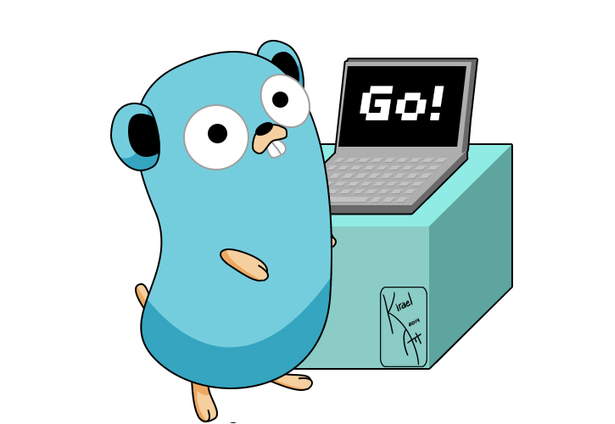

<h1 align="center">
	
	 
	 
</h1>

## Table of Contents
  1. Getting started
    * [What is Golang](examples/getting_started/what_is_golang.md)
    * [Go basic syntax](examples/getting_started/go_syntax.md)
    * [Go program structure](examples/getting_started/go_program_structure.md)
  2. [Variables](examples/variables/variables.go)
  3. [Data Types](examples/data_types)
    * [Bools](examples/data_types/bool/bool.go)
    * [Numerics](examples/data_types/numeric/numeric.go)
    * [Strings and string methods](examples/data_types/string/string.go)
  4. [Constants](examples/constant/constant.go) 
  5. [Operators](examples/operators)
    * [Arithmetic Operators](examples/operators/arithmetic/arithmetic.go)
    * [Relational Operators](examples/operators/relational/relational.go)
    * [Logical Operators](examples/operators/logical/logical.go)
    * [Bitwise Operators](examples/operators/bitwise/bitwise.go)
    * [Miscellaneous Operators](examples/operators/misc/misc.go)
